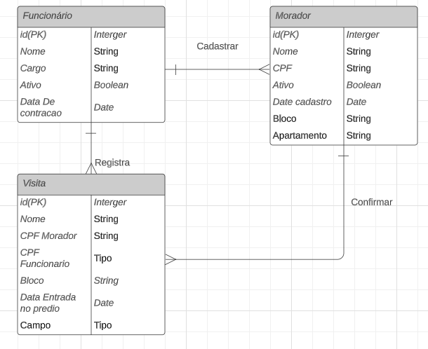

# Projeto Final DW2S6
## Projeto de controle de acesso de prédio e condomínios

## Modelo Relacional
### Estruta do modelo do banco de dados

## Buildar o projeto
* Abrir com TSL.
* Realizar o update do pom
* No arquivo application.properties mudar o `url` de coenxão do banco para localhost.
* Subir o serviço.
